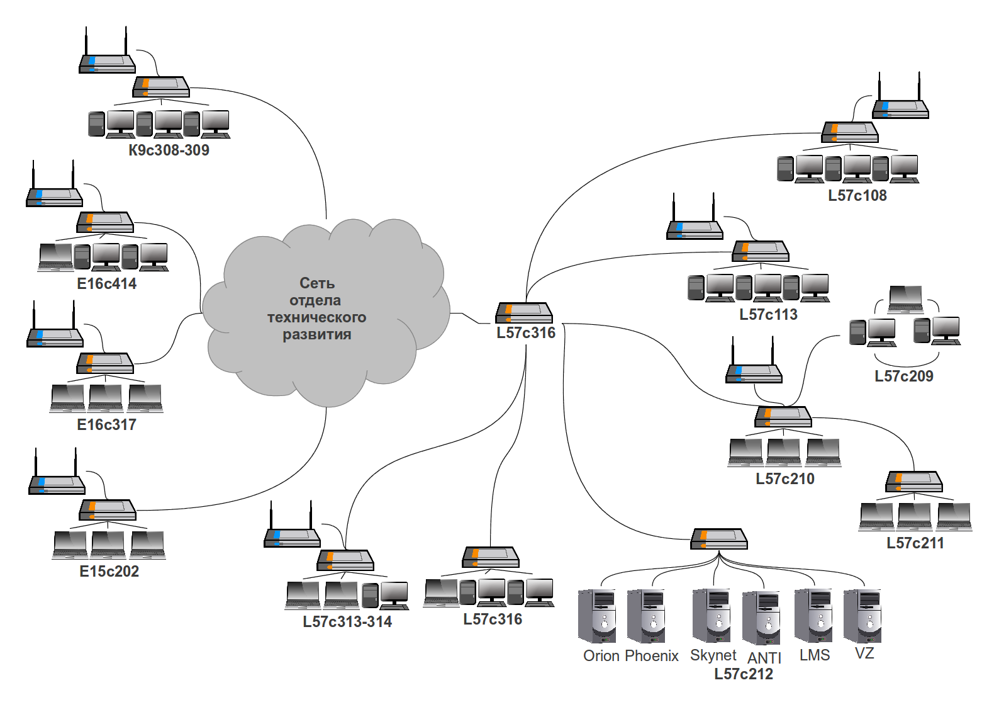

# Лб 01. Моделирование топологий компьютерных сетей

## Задание 1. Установите в подготовленную ранее операционную систему утилиту "NetEmul"
([скачать](http://netemul.sourceforge.net/rudownload.html) или найдите в папке на сервере).

## Задание 2. Спроектируйте в отдельных файлах следующие топологии: 
- общая шина
- кольцо
- звезда

    В моделируемых тпологиях должно быть не менее 5 рабочих станций.

## Задание 3. Постройте действующую модель учебной компьютерной сети МГГУ (пример схемы сети). В схеме беспроводные устройства можно не учитывать.

*Рисунок 1. Схема сети*

## Задание 4. Самостоятельно реализуйте модель Arp spoofing (скачать 1, скачать 2).

## Задание 5. В качестве ответа на это задание прикрепите файлы моделей и снимки экрана с построенными моделями.